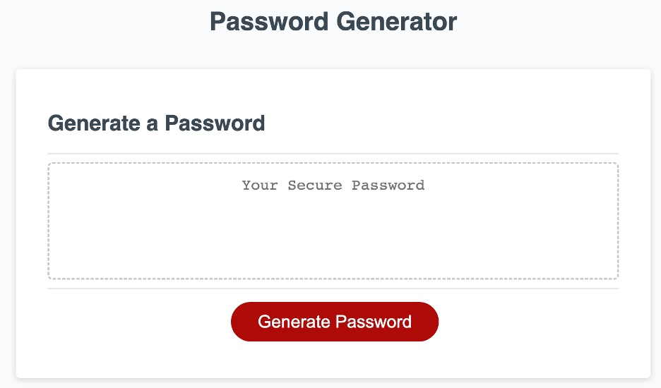
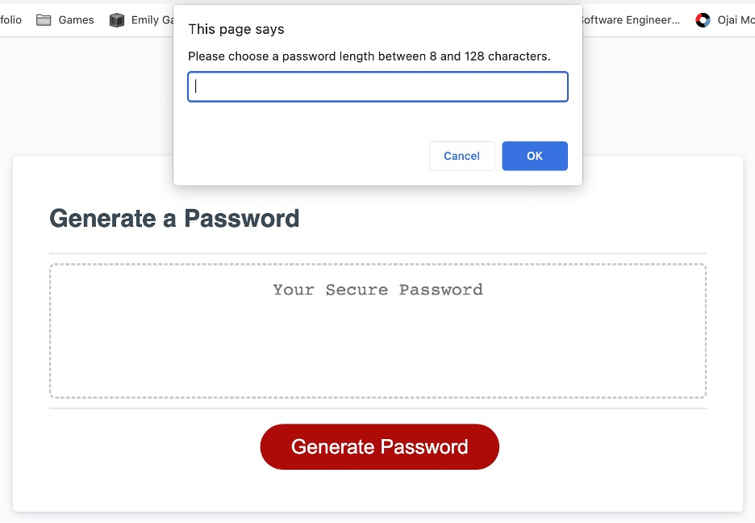

# Password Generator

## Technology Used 

| Technology Used         | Resource URL           | 
| ------------- |:-------------:| 
| JavaScript    | [https://developer.mozilla.org/en-US/docs/Web/JavaScript](https://developer.mozilla.org/en-US/docs/Web/JavaScript) | 
<br/> 

## Description 

[Visit the Deployed Password Generator](https://rmoscoe.github.io/password-generator)

This app randomly generates a password according to criteria the user specifies:
* The number of characters (between 8 and 128)
* Whether to include lower-case letters
* Whether to include upper-case letters
* whether to include numeric characters
* whether to include special characters

After validating the user's selections, the app generates and displays a password. The HTML and CSS were provided for this project, along with some starter JavaScript code. I wrote the function called by the "Generate Password" button to capture the user input and generate the password.
<br/>

## Starter Code

This project did not require refactoring so much as completion. The starter JavaScript code is shown below.


```javascript
// Assignment Code
var generateBtn = document.querySelector("#generate");

// Write password to the #password input
function writePassword() {
  var password = generatePassword();
  var passwordText = document.querySelector("#password");

  passwordText.value = password;

}

// Add event listener to generate button
generateBtn.addEventListener("click", writePassword);
```
<br/>

## Usage 

The screenshot below shows the password generator. To begin, click the "Generate Password" button.

[](https://rmoscoe.github.io/password-generator/)

<br/>
After clicking the button, a series of prompts and confirmations allows the user to specify the length of the password and the types of characters to include, as shown below.

[](https://rmoscoe.github.io/password-generator)

<br/>

A password is automatically generated, as shown below.

[](https://rmoscoe.github.io/password-generator)

<br/>

## Learning Points 


I had prior knowledge of most of the concepts required to complete this project, but I learned about prompt boxes and confirmation boxes.
<br/>

## Author Info

### Ryan Moscoe 


* [Portfolio](https://rmoscoe.github.io/portfolio/)
* [LinkedIn](https://www.linkedin.com/in/ryan-moscoe-8652973/)
* [Github](https://github.com/rmoscoe)
<br/>

## Credits

Starter code provided by Trilogy Education Services, LLC, a 2U, Inc. brand, in conjunction with the University of California, Berkeley.


## License

See repository for license information.